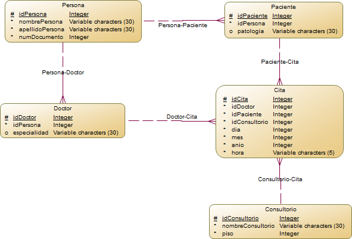

# API de Gestión de Consultas Médicas (Prueba Tecnica UDNet)

## Descripción

Esta API gestiona información sobre **personas, pacientes, doctores, consultorios y citas** dentro de un sistema de consultas médicas básico, en donde solo se tiene en cuenta la parte de almacenamiento en la base de datos de la cita. El diagrama Entidad-Relación muestra las conexiones entre estas entidades:


(Para la realización del Diagrama se implementó PowerDesigner)

- **Persona:** Contiene datos generales (nombre, apellido, documento).
- **Paciente:** Extiende Persona y almacena información médica relevante.
- **Doctor:** También se basa en Persona y tiene una especialidad.
- **Consultorio:** Espacio físico donde se atienden las citas.
- **Cita:** Relaciona a un doctor, un paciente y un consultorio en una fecha y hora determinada.

---

## Montaje de la Base de Datos

Para configurar la base de datos:

### 1️⃣ Ubicación del script SQL
El script de creación de la base de datos se encuentra en:
```
DiagramacionBD\CitasMedicasDBscript.sql
```
Este archivo contiene la estructura de las tablas y datos de prueba insertados.

### 2️⃣ Configurar PostgreSQL
Para este caso se implemento postgres:
```sql
CREATE DATABASE PruebaTecnicaUDNet;
```

### 3️⃣ Ejecutar el script SQL
Importar el archivo `CitasMedicasDBscript.sql` en PostgreSQL:

### 4️⃣ Verificación de datos
Para verificar que todo se ejecuto correctamente se realiza una consulta simple:
```sql
SELECT * FROM persona;
```

---

## Instalación y Ejecución

Pasos a seguir para ejecutar el proyecto, con tecnologías implementadas: **Node.js y NPM**.

### 1️⃣ Clonar el repositorio
Ejecuta el siguiente comando en la terminal:
```sh
git clone https://github.com/camilo-a-g-z/PruebaTecnicaUDNet
cd repositorio
```

### 2️⃣ Iniciar un proyecto NPM
Ejecuta:
```sh
npm install  # Carga dependencias en package.json y las descarga
```

### 3️⃣ Ejecutar el servidor
Para iniciar la API:
```sh
npm start
```
**Importante:** Para este caso las variables usuario y contraseña se dejaron insertadas directamente en codigo, para cambiarlas se debe ir a:
```
API\models\postgres\conection.js
```
Y cambiarlas segun la configuracion propia

---

## Endpoints Principales

La API expone los siguientes endpoints:

### **GET Endpoints**
| Método | Endpoint       | Descripción                    |
| ------ | -------------- | ------------------------------ |
| GET    | `/persona`     | Obtiene todas las personas     |
| GET    | `/paciente`    | Obtiene todos los pacientes    |
| GET    | `/doctor`      | Obtiene todos los doctores     |
| GET    | `/consultorio` | Obtiene todos los consultorios |
| GET    | `/cita`        | Obtiene todas las citas        |

### **POST Endpoints**
```http
POST http://localhost:3000/persona
Content-Type: application/json
{
    "idpersona": 25,
    "nombrepersona": "Juan",
    "apellidopersona": "Perez",
    "numdocumento": 123456789
}
```
```http
POST http://localhost:3000/paciente
Content-Type: application/json
{
    "idpaciente": 15,
    "idpersona": 1,
    "patologia": "Gripe"
}
```
```http
POST http://localhost:3000/doctor
Content-Type: application/json
{
    "iddoctor": 15,
    "idpersona": 1,
    "especialidad": "Medicina General"
}
```
```http
POST http://localhost:3000/consultorio
Content-Type: application/json
{
    "idconsultorio": 19,
    "nombreconsultorio": "Consultorio 1",
    "piso": 1
}
```
```http
POST http://localhost:3000/cita
Content-Type: application/json
{
    "idcita": 15,
    "iddoctor": 1,
    "idpaciente": 1,
    "idconsultorio": 1,
    "dia": 1,
    "mes": 1,
    "anio": 1,
    "hora": "10:00"
}
```

### **PATCH Endpoints**
```http
PATCH http://localhost:3000/persona/1
Content-Type: application/json
{
    "nombrepersona": "Juan",
    "apellidopersona": "Perez",
    "numdocumento": 123456789
}
```
```http
PATCH http://localhost:3000/paciente/1
Content-Type: application/json
{
    "idpersona": 1,
    "patologia": "Gripe"
}
```
```http
PATCH http://localhost:3000/doctor/1
Content-Type: application/json
{
    "idpersona": 1,
    "especialidad": "Medicina General"
}
```
```http
PATCH http://localhost:3000/consultorio/1
Content-Type: application/json
{
    "nombreconsultorio": "Consultorio 1",
    "piso": 3
}
```
```http
PATCH http://localhost:3000/cita/1
Content-Type: application/json
{
    "iddoctor": 1,
    "idpaciente": 1,
    "idconsultorio": 2,
    "dia": 1,
    "mes": 1,
    "anio": 2021
}
```

---

## Notas Finales
- El servidor se ejecuta en **http://localhost:3000/** por defecto.
- El apartado web es un html simple, basta con abrirlo en un navegador sin ningun otro procedimiento
- La base de datos ya incluye datos de prueba para su uso inmediato.
- Los endpoint se pueden encontrar en la Carpeta API en **api.http**

## Imagenes de referencia
### Pagina web funcionando

### Endpoint funcionando
